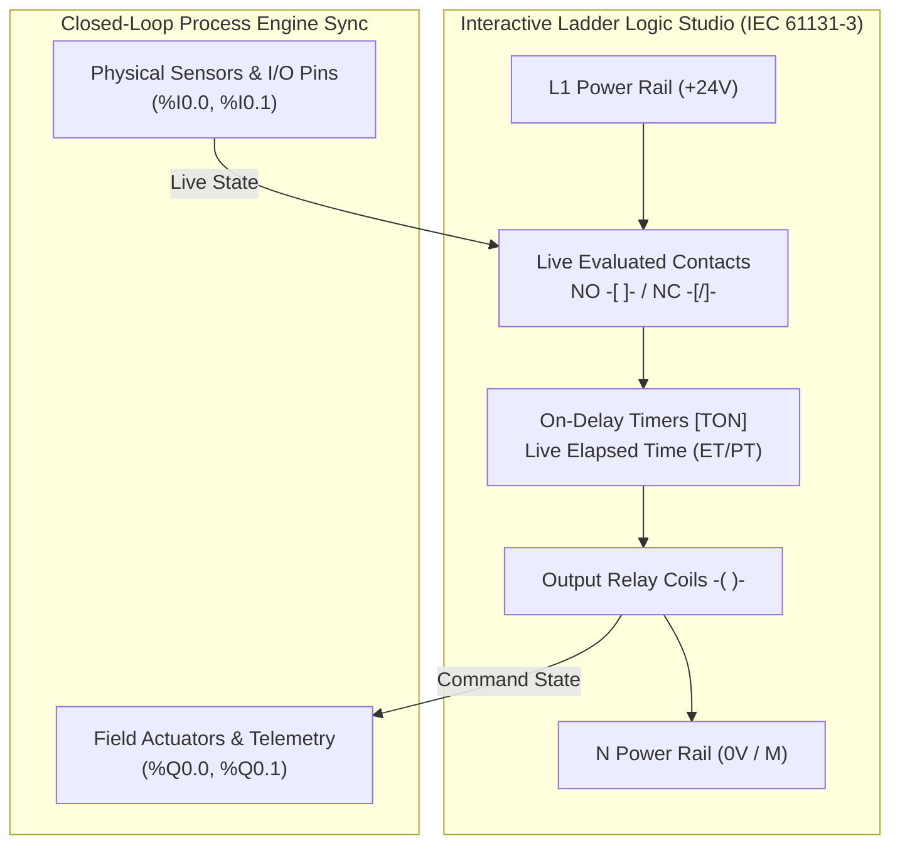

# Virtual Mentorship & Augmented Reality – Industrial PLC Training & Digital Twin Platform
## Comprehensive Technical Report & Multi-Experiment Student Learning Architecture

---

## 1. Executive Summary & Purpose

### 1.1 Project Title
**WebAR-Based Industrial Automation & PLC Digital Twin with Interactive Ladder Logic, AI Mentorship, and 5 Multi-Application Suites**

### 1.2 Core Purpose & Student Learning Mission
Traditional industrial automation training in universities and vocational centers is severely constrained by:
- **High Equipment Costs & Risk of Burnout**: Physical Siemens S7-1200 PLCs, multi-axis robots, chemical reactors, conveyor drives, and inductive sensors cost thousands of dollars. Novice student wiring mistakes cause electrical short circuits and equipment damage.
- **Limited Bench Access**: Physical training benches cannot scale to large student batches.
- **Abstract Ladder Logic Comprehension**: Students struggle to correlate abstract 2D Ladder Diagrams (LAD) with physical terminal wiring ($DI/DO$) and live real-time process physics.

### 1.3 Solution & Platform Highlights
This project provides a zero-risk, accessible, photorealistic **Web-based Augmented Reality (WebAR) Industrial Training Digital Twin** featuring:
1. **5 Complete Industrial Applications**:
   - **Experiment 1**: Water Tank Closed-Loop PID Level Control (Centrifugal Pump, Proportional Valve, Level Indicator Tower, Dynamic Piping).
   - **Experiment 2**: Automated Conveyor Belt & Optical Sorting (Siemens Gearmotor, Photoelectric Beam Sensor, Pneumatic Diverter Cylinder, Rejection Chute).
   - **Experiment 3**: Smart 4-Way Traffic Light & Pedestrian Crosswalk Junction (Main Signal Post, Pedestrian Walk/Don't Walk Station, Inductive Road Loop Vehicle Sensor, Animated Vehicles).
   - **Experiment 4**: 3-Axis Industrial Robotic Pick-and-Place Workcell (Cartesian X/Y Linear Rails, Z Pneumatic Cylinder, Vacuum Suction End-Effector, In-Feed Nest, Sorting Pallets).
   - **Experiment 5**: Industrial Thermal Batch Mixing Reactor & Chemical Vessel (Dual In-Feed Solenoid Dosing A/B, Dual-Tier Vortex Impeller Agitator, Electrical Thermal Heating Jacket, RTD PT100 Sensor, Drain Discharge).
2. **Interactive Live Ladder Logic Studio (IEC 61131-3 Standard)**:
   - Live animated power rails with real-time current flow visualization.
   - Dynamic Normally Open `-[ ]-`, Normally Closed `-[/]-`, `[TON]` Timers, and Output Coils `-( )-`.
   - Step-by-step educational breakdown with Boolean logic algebra, industrial application rationale, and student knowledge check quizzes.
3. **Curated Industrial Orange & Slate Theme**:
   - Modern industrial safety orange palette (`#ff6b00`, `#ff8800`) paired with high-contrast slate dark glassmorphism.
   - Typography powered by Google Fonts **Outfit** and **JetBrains Mono**.
   - Fully responsive for mobile, tablet, and desktop.

---

## 2. 5 Industrial Digital Twin Applications Breakdown

| Exp # | Application Title | Primary 3D Equipment | PLC Inputs (%I) | PLC Outputs (%Q) | Process Physics & Simulation |
| :--- | :--- | :--- | :--- | :--- | :--- |
| **Exp 1** | **Water Tank Closed-Loop Level Control** | Cylindrical Acrylic Tank, Centrifugal Motor Pump, Proportional Gate Valve, Dual-Lamp Stand, Catmull-Rom Piping. | `%I0.0` (Low Float L0) `%I0.1` (High Float L1) | `%Q0.0` (Pump Starter) `%Q0.1` (Drain Valve) | PID / Bang-bang closed-loop level hold, dynamic fluid volume shimmer, pump impeller RPM, cavitation & overflow protection. |
| **Exp 2** | **Automated Conveyor & Optical Sorting** | Extruded Aluminum Chassis, Continuous Rubber Belt, Siemens Gearmotor, SMC Pneumatic Pusher, Rejection Chute. | `%I0.0` (IR Beam Sensor) `%I0.1` (Start Pushbutton) | `%Q0.0` (Gearmotor Drive) `%Q0.1` (Diverter Solenoid) | Real-time workpiece package travel physics, high-speed optical beam detection, timed diverter reject stroke, sort yield counter. |
| **Exp 3** | **Smart 4-Way Traffic & Pedestrian Junction** | 4-Way Asphalt Road Intersection, Traffic Signal Post with Fresnel Lenses, Pedestrian Post, Inductive Road Loop Sensor, 3D Cars. | `%I0.0` (Ped Call PB) `%I0.1` (Vehicle Loop Sensor) | `%Q0.0` (Signal Matrix) `%Q0.1` (Ped Walk Light) | Multi-phase timed traffic sequencer (Green/Yellow/Red), pedestrian call queue with countdown, inductive vehicle detection, emergency corridor strobe. |
| **Exp 4** | **3-Axis Robotic Pick-and-Place Workcell** | 4-Post Gantry Frame, X/Y Linear Rail Guides, Z Pneumatic Slide Cylinder, Silicone Vacuum Suction Cup, In-Feed Part Nest. | `%I0.0` (Part Presence Prox) `%I0.1` (Gantry Home LS) | `%Q0.0` (Gantry Servo Drive) `%Q0.1` (Vacuum Solenoid) | Coordinated Cartesian inverse kinematics, vacuum pressure suction grip, smooth trajectory interpolation, parts transfer counter. |
| **Exp 5** | **Thermal Batch Reactor & Chemical Mixer** | 316L Stainless Steel Jacketed Vessel, Dual Dosing Solenoid Valves, Dual-Tier Vortex Impeller Stirrer, Heating Coils, PT100 RTD. | `%I0.0` (PT100 Temp Sensor) `%I0.1` (Recipe Start PB) | `%Q0.0` (Agitator Contactor) `%Q0.1` (Thermal Heater SSR) | ISA-88 recipe batching (Dosing A/B $\rightarrow$ Agitation $\rightarrow$ Thermal Heating to 75°C $\rightarrow$ Cook Hold $\rightarrow$ Discharge), fluid color blending (Blue+Yellow $\rightarrow$ Green), steam vapor physics. |

---

## 3. Interactive Ladder Logic Studio Architecture

### Educational Features:
1. **Live Power Rail Animation**: Visualizes energized current paths across rungs in real time at 10ms scan cycles.
2. **Rung-by-Rung Educational Guide**: Details Boolean equations ($Q = (I_1 \lor Q) \land \neg I_0$), hardware terminal pin mapping, and industrial safety interlock theory.
3. **Student Knowledge Check Quiz**: Interactive mini-tests with instant feedback on contact logic, seal-in circuits, and timers.

---

## 4. UI Design & Clean Industrial Orange Theme

- **Primary Accent**: Industrial Orange (`#ff6b00`, `#ff851a`) symbolizing industrial robotics, safety, and automation standards.
- **Background**: Modern Slate & Graphite Glassmorphism (`#060913`, `#0b1221`, `#0f172a`).
- **Typography**: Google Fonts **Outfit** (headings & titles) + **Inter** (body & controls) + **JetBrains Mono** (schematics, memory tags & code).
- **Responsive Layout**: Seamless cross-platform support across desktops, laptops, iPads/tablets, and mobile smartphones.

---

*Report updated for Multi-Experiment Industrial AR PLC Training & Digital Twin Suite.*
